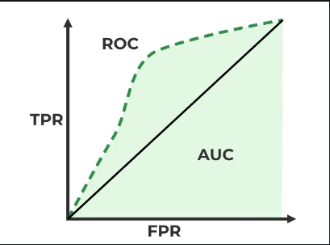

출처  https://www.geeksforgeeks.org/auc-roc-curve/

ROC (Receiver Operating Characteristic) 곡선은 이진 분류 문제에서 분류기의 성능을 평가하기 위해 사용되는 도구입니다. ROC 곡선은 다양한 임곗값에서의 분류기 성능을 시각화하며, TPR (True Positive Rate)과 FPR (False Positive Rate)를 사용하여 생성됩니다.

### 주요 개념

1. **True Positive Rate (TPR)**:
    - **민감도(Sensitivity)** 또는 **재현율(Recall**)이라고도 합니다.
    - 실제로 긍정인 샘플 중에서 모델이 긍정으로 올바르게 예측한 비율을 의미합니다.
    - TPR = TP / (TP + FN)
        - TP (True Positive): 실제 긍정인 샘플을 긍정으로 예측한 경우
        - FN (False Negative): 실제 긍정인 샘플을 부정으로 예측한 경우
2. **False Positive Rate (FPR)**:
    - 실제로 부정인 샘플 중에서 모델이 긍정으로 잘못 예측한 비율을 의미합니다.
    - FPR = FP / (FP + TN)
        - FP (False Positive): 실제 부정인 샘플을 긍정으로 예측한 경우
        - TN (True Negative): 실제 부정인 샘플을 부정으로 예측한 경우

### ROC 곡선

- **X축**: FPR (False Positive Rate)
- **Y축**: TPR (True Positive Rate)

ROC 곡선은 여러 임곗값에 대해 TPR과 FPR 값을 계산하여 그린 그래프입니다. 임곗값이 0부터 1까지 변화함에 따라 TPR과 FPR 값이 변하게 되며, 이 변화를 시각화한 것이 ROC 곡선입니다.

### AUC (Area Under the Curve)

- **AUC**는 ROC 곡선 아래의 면적을 의미합니다.
- AUC 값은 0과 1 사이의 값이며, 클수록 분류기의 성능이 우수함을 나타냅니다.
    - AUC = 0.5인 경우: 분류기가 무작위 추측과 동일한 성능을 보임.
    - AUC = 1인 경우: 분류기가 모든 샘플을 완벽하게 분류함.

### 장점

- **임곗값에 무관한 성능 평가**: ROC 곡선은 다양한 임곗값에서의 성능을 평가하므로, 특정 임곗값에 의존하지 않는 분류기 성능 평가가 가능합니다.
- **불균형 데이터셋에 유용**: 데이터셋이 불균형한 경우에도 ROC 곡선은 유용한 성능 평가 도구입니다.

### 단점

- **실제 확률 분포를 반영하지 않음**: ROC 곡선은 양성과 음성의 실제 분포를 반영하지 않기 때문에, 특정 상황에서는 Precision-Recall 곡선이 더 유용할 수 있습니다.

